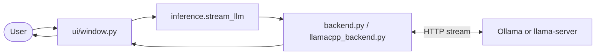
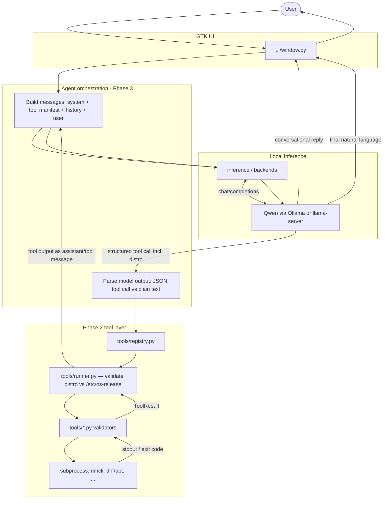

# Phase 2 — Tool layer: detailed plan

**Parent doc:** [meera_roadmap.md](../meera_roadmap.md)  
**Goal:** A clean, typed catalog of every action the assistant may take, with no raw shell escape hatch.  
**Timeline (roadmap):** Day 2–3 for *definition*; expect longer if you implement stubs for every module below in one pass.

---

## Data flow (today vs after Phase 3)

Phase 2 defines **tools** and a **registry**; the loop that connects the model to those tools lands in **Phase 3**. The diagrams below show how prompts and results move through the stack.

### Today (Phase 1 — chat only)



Plain text in → model → streamed tokens out. **No tool execution.**

### Target (Phase 3 — agent loop on top of Phase 2 tools)



**How to read it:** The model either answers directly (small talk, no matching tool) or emits a **bounded JSON** tool call including **`distro`: `"ubuntu"` \| `"fedora"`** (runner injects or checks it against **`/etc/os-release`** before any system command). The runner validates arguments, executes only **allowlisted** `tools/*.py` helpers (which call `subprocess` with fixed argv — never a user shell). The tool’s structured result is **fed back into the chat** as another message; the model turns that into a normal reply for the user. Phase 2’s job is to make **registry + per-tool executors + `ToolResult`** solid so this loop is safe and testable.

---

## 1. Objectives

1. **Single source of truth** — Every capability is a named tool with a schema the model (later) can target; humans can read one registry file or generated manifest.
2. **Type safety at boundaries** — Parameters are validated before any `subprocess` or filesystem work; failures return structured errors, not tracebacks to the UI.
3. **Least privilege** — Tools run as the Meera user by default; elevated actions are explicit, rare, and gated (documented “requires polkit / sudo” paths).
4. **Testability** — Each tool module is unit-testable with faked subprocesses / temp dirs; no GTK dependency inside `tools/`.
5. **Phase 3–ready** — Output shape matches what an intent loop will need: `tool_name`, `params`, `result` / `error_code` / `message`.

---

## 2. Non-goals (defer to Phase 3+)

- Wiring tools into the model prompt or parsing model JSON (Phase 3).
- Voice, tray daemon, RAG (later phases).
- Fine-tuning or eval datasets (Phases 4–5).

---

## 3. Proposed repository layout

```
meera/
  tools/
    __init__.py          # re-export registry, public types
    schema.py            # ToolSpec, ParamSpec, ToolResult, errors
    registry.py          # TOOLS: list[ToolSpec], lookup by name
    runner.py            # validate + dispatch + timeout wrapper (optional in Phase 2)
    platform.py          # detect_distro() -> "ubuntu" | "fedora" from /etc/os-release
    system.py            # wifi, bluetooth, brightness, volume, power
    files.py             # search, safe path ops
    processes.py         # list, signal (bounded)
    packages.py          # dnf, flatpak (read-only or gated writes)
    scheduler.py         # systemd user timers / reminders (narrow scope)
```

**Naming:** Use stable `snake_case` tool ids (e.g. `wifi_list_networks`, `volume_set_percent`). These ids are what Phase 3 will put in JSON.

---

## 4. Core abstractions (`tools/schema.py`)

### 4.1 Tool metadata

Each tool exposes:

| Field | Purpose |
|--------|---------|
| `name` | Unique id, stable across releases |
| `description` | Short text for model “menu” and docs |
| `parameters` | List of params: `name`, `type`, `required`, `default`, `description` |
| `requires_elevation` | Bool; if true, runner refuses unless explicitly allowed |
| `read_only` | Bool; if true, no mutating FS/system calls (for safer dry-runs later) |

Use **Python `typing`** (`TypedDict` / `dataclass`) for in-code definitions; optionally add JSON Schema generation for Phase 3 prompts.

### 4.2 Execution result

Standard return type, e.g. `ToolResult`:

- `ok: bool`
- `data: dict | list | str | None` — machine-readable payload
- `message: str` — human-readable summary for the model or UI
- `error_code: str | None` — e.g. `TIMEOUT`, `PERMISSION_DENIED`, `VALIDATION_ERROR`, `COMMAND_FAILED`

### 4.3 Parameter validation

- Reject `..`, absolute paths outside an allowlist where applicable (files).
- Max string lengths, bounded integers (e.g. volume 0–150%), enums where fixed (`flatpak` vs `rpm`).
- No `shell=True`. Arguments passed as **lists** to `subprocess.run`.

### 4.4 Host distribution — `distro` argument

Ubuntu vs Fedora differ for **package managers** and sometimes for **which audio CLI is preferred**; NetworkManager, systemd user units, and Flatpak are largely shared.

**Contract (Phase 3 JSON tool calls + Phase 2 runner):**

1. **Canonical values:** `distro` is **`"ubuntu"`** or **`"fedora"`** (lowercase string enum). Document this in every tool’s parameter list in the manifest so the model includes it.
2. **Detection:** `tools/platform.py` implements `detect_distro() -> Literal["ubuntu", "fedora"]` by reading **`/etc/os-release`** (`ID=ubuntu` → `ubuntu`; `ID=fedora` or `ID`/`ID_LIKE` indicating RHEL family → `fedora`). If unknown, return a structured error and do not guess.
3. **Runner behavior (`run_tool`):**
   - If **`params` omits `distro`**, **inject** `distro = detect_distro()` before dispatch (convenience).
   - If **`params["distro"]` is present**, it **must equal** `detect_distro()`; otherwise return **`ToolResult`** with `ok=False`, `error_code="DISTRO_MISMATCH"`, and **do not run** any subprocess (prevents the model from requesting `apt` on a Fedora host).
4. **Implementations:** Handlers receive the **validated** `distro`. Use it wherever behavior splits:
   - **`packages.py`:** `fedora` → `dnf` / `rpm`; `ubuntu` → `apt` / `apt-get` (read-only checks first).
   - **`system.py` (volume):** prefer **`wpctl`** when available on both; if you keep **`pactl`** fallbacks, order or availability checks may depend on `distro` / image defaults.
   - **Tools that are identical** on both (e.g. `nmcli` Wi‑Fi) still **accept `distro` in the schema** for a uniform tool-call shape; they may **ignore** it internally.

**Manifest / `tools_manifest_json()`:** Include `distro` in the serialized parameter list for **all** tools (required in the schema the model sees, even if optional at runtime thanks to runner injection).

---

## 5. Module-by-module plan

### 5.1 `tools/system.py`

| Tool (example id) | Behavior | Underlying commands |
|-------------------|----------|---------------------|
| `wifi_list_networks` | List visible SSIDs | `nmcli` |
| `wifi_status` | Connected AP, signal | `nmcli` |
| `wifi_connect` | Connect with SSID (+ optional password param) | `nmcli` — secrets via env/file, never log password |
| `bluetooth_status` | Adapter + paired devices | `bluetoothctl` or `nmcli` |
| `brightness_get` / `brightness_set` | Screen backlight | `brightnessctl` (graceful skip if missing) |
| `volume_get` / `volume_set_percent` | Default sink | Prefer `wpctl` when present; else `pactl`. Use **`distro`** to tune probe order or defaults if needed per image. |
| `power_suspend` / `power_logout` | Session actions | `loginctl` (prefer over direct `systemctl suspend` for user session) |

**Safety:** Timeouts (e.g. 15–30s); strip environment; no arbitrary command strings.

### 5.2 `tools/files.py`

| Tool | Behavior |
|------|----------|
| `file_search_name` | Search under `XDG` dirs or user-provided root with **path allowlist** |
| `file_read_tail` | Read last N lines of a file (size cap, e.g. 256 KiB) |
| `file_list_dir` | Non-recursive listing with max entries |

Implementation: `pathlib` for path logic; `subprocess` to **`fd`** or **`rg --files`** only through fixed argument templates (user input never concatenated into flags).

**Explicitly out of scope for v1:** `rm -rf`, arbitrary write, chmod on system paths.

### 5.3 `tools/processes.py`

| Tool | Behavior |
|------|----------|
| `process_list` | Top N by CPU or memory (`ps` fixed format) |
| `process_signal` | Send `SIGTERM`/`SIGKILL` to **PID** with confirmation policy in Phase 3 |

Cap output rows. Never accept regex shell.

### 5.4 `tools/packages.py`

**Requires validated `distro`.** Start **read-only**:

| Tool | Behavior |
|------|----------|
| `packages_list_updates` | **`fedora`:** `dnf check-update` (or `dnf list --upgrades`). **`ubuntu`:** `apt-get update` (cached) + `apt list --upgradable` or equivalent — no install. |
| `flatpak_list` | `flatpak list` — same on both; `distro` unused but still passed for uniform calls. |

**Mutating** installs/removes: add only after explicit design (polkit, `--assumeyes` never default on).

### 5.5 `tools/scheduler.py`

Narrow v1:

| Tool | Behavior |
|------|----------|
| `reminder_list` | `systemctl --user list-timers` parse |
| `timer_describe` | Show next run for a **known-prefix** unit name |

Creating timers: defer until Phase 3 can validate unit names and you document security.

---

## 6. Registry (`tools/registry.py`)

- Build `TOOLS: list[ToolSpec]` by importing each module’s exported specs.
- Provide `get_tool(name) -> ToolSpec | None`.
- Provide `tools_manifest_json() -> str` for Phase 3 system prompts (compact JSON).

**Versioning:** Add `TOOLS_SCHEMA_VERSION = 1` in case prompt format changes.

---

## 7. Runner (`tools/runner.py`) — optional in Phase 2

Minimal Phase 2 can stop at **definitions + stub implementations** that raise `NotImplementedError`. Recommended before closing Phase 2:

- `run_tool(name: str, params: dict) -> ToolResult`
- **Resolve `distro`:** inject from `detect_distro()` if missing; validate match if present (see §4.4).
- Global **timeout** (e.g. 30s default, per-tool override)
- Catch `subprocess.TimeoutExpired`, `CalledProcessError`, `ValidationError` → `ToolResult`

Keep runner **free of GTK**; Meera UI calls it from a worker thread in Phase 3.

---

## 8. Security checklist (apply while coding)

1. **No** `shell=True`.  
2. **No** string interpolation into shell one-liners.  
3. **Allowlists** for filesystem paths where tools accept user-provided locations.  
4. **Timeouts** on every external command.  
5. **Secrets** only via secure inputs (Phase 3 UI or keyring); never log.  
6. **Elevation:** default deny; document each tool that needs `wheel` / polkit.  
7. **Output limits** — truncate long stdout with “(truncated)” marker.

---

## 9. Testing strategy

| Layer | What |
|-------|------|
| Unit | Param validation, path rejection, registry completeness |
| Integration (optional) | Mark `@pytest.mark.integration` — run only on developer machine with nmcli etc. |
| Mocks | `unittest.mock` patch `subprocess.run` for CI without hardware |

Target: every **implemented** tool has at least one test; stubs can skip until implemented.

---

## 10. Suggested implementation order (within Phase 2)

1. **`platform.py` + `schema.py` + `registry.py` skeleton** — `detect_distro()`, dummy tool `ping` returns `ok`, manifest lists `distro` param.  
2. **`system.py`** — `volume_get` / `brightness_get` (usually safe reads), accept `distro`.  
3. **`files.py`** — `file_list_dir` under `$HOME` only (`distro` in schema, ignored).  
4. **`processes.py`** — `process_list` (`distro` in schema, ignored).  
5. **`packages.py`** — read-only list commands **branching on `distro`**.  
6. **`scheduler.py`** — `reminder_list`.  
7. **Wifi / connect / mutating package ops** — last, after threat review.

---

## 11. Documentation deliverables

- **`tools/README.md`** (short): how to add a tool, security rules, how to run tests.  
- Update **`meera_roadmap.md`** Phase 2 with a link to this file when Phase 2 is “defined” or “implemented.”

---

## 12. Exit criteria (Phase 2 done)

- [ ] `tools/` package exists with `schema`, `registry`, and at least **three** modules with **at least one real implementation** each (not only stubs).  
- [ ] Every implemented tool has typed parameters, docstring description, and tests or documented reason for deferral.  
- [ ] `tools_manifest_json()` (or equivalent) can dump the catalog for Phase 3.  
- [ ] Security rules in section 8 are enforced in code for implemented tools.  
- [ ] **`distro`** is in the manifest for all tools; runner implements inject + **DISTRO_MISMATCH** guard (§4.4).  
- [ ] No raw user shell anywhere in `tools/`.

---

## 13. Handoff to Phase 3

Phase 3 will:

1. Inject `tools_manifest_json()` into the system prompt (or native function-calling if you adopt OpenAI-style tools in Ollama/llama.cpp), including **`distro`** on every tool schema.  
2. Parse model output → `run_tool` (with **§4.4** `distro` handling) → second model turn for natural language.  
3. Add UI affordances (confirm destructive actions).

This plan keeps Phase 2 focused on **catalog + safe executors**; orchestration stays out until Phase 3.
