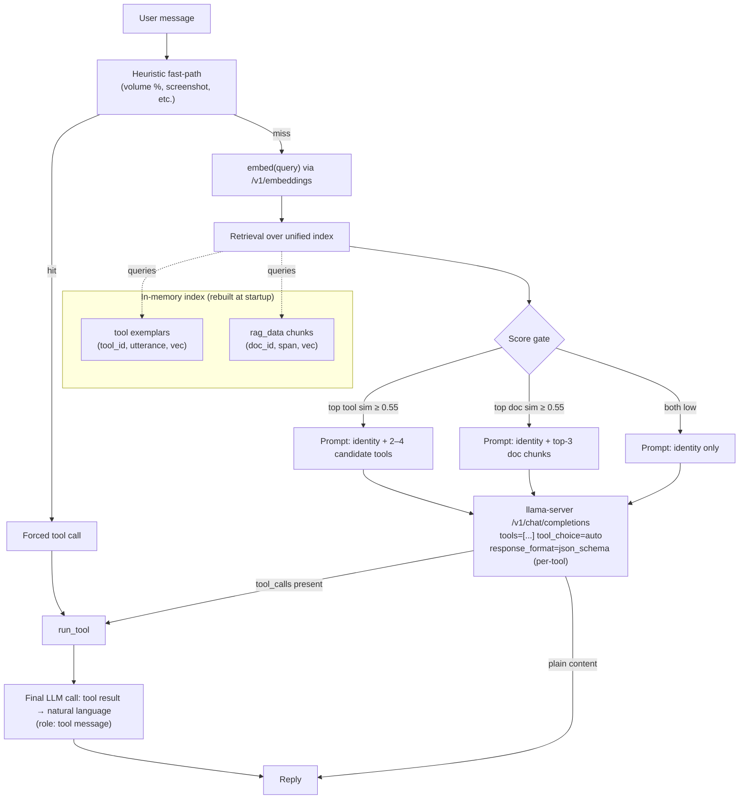
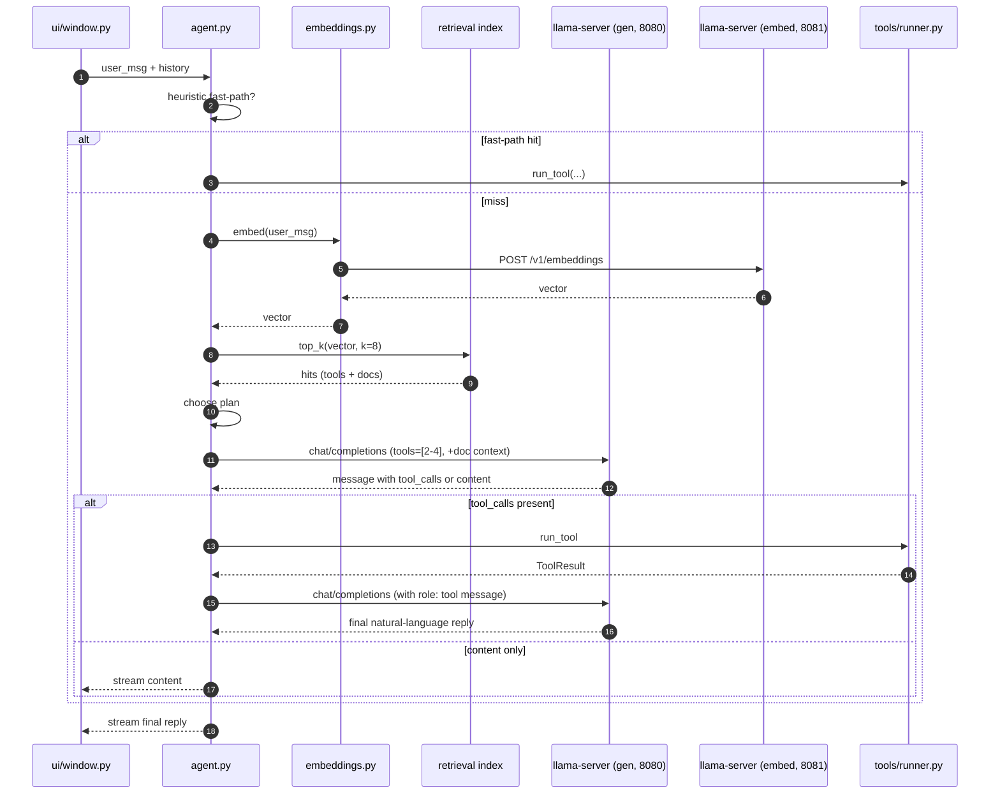

# Phase 4 — Retrieval-First Agent with Native Tool Calls and RAG

**Parent doc:** [meera_roadmap.md](../meera_roadmap.md)
**Predecessor:** [Phase2_plan.md](./Phase2_plan.md) (tool layer) and the Phase 3 agent loop in [agent.py](../agent.py).
**Goal:** Replace the current two-step LLM router (`build_route_system_message_content` + `build_tool_selection_system_message_content` in [agent.py](../agent.py)) with a single retrieval pass that narrows the tool surface to 2–4 candidates, then a single LLM call using llama.cpp's native tool-calling format. The same retrieval index also serves RAG over [rag_data/](../rag_data/).

---

## Target architecture



Two HTTP services running locally:

- `llama-server` on port `8080` for **generation** (Qwen 3.5 2B Q4_K_M, as today).
- `llama-server` on port `8081` for **embeddings** (`bge-small-en-v1.5` Q8_0 GGUF, ~130 MB), launched with `--embeddings`. This is the small sentence-transformer; it has no chat capability.

---

## Components

### 1. Embedding service

- Extend [run_meera.sh](../run_meera.sh) to download a pinned `bge-small-en-v1.5.Q8_0.gguf` to `.cache/meera/models/` (SHA256-checked, same pattern as the generation GGUF) and start a second `llama-server` instance with `--embeddings --port 8081`. Add reachability check + log path `/tmp/llama_meera_embed.log`. Mirror the existing `MEERA_LLAMACPP_*` env vars with `MEERA_EMBED_*` equivalents (`MEERA_EMBED_URL`, `MEERA_EMBED_MODEL`, `MEERA_EMBED_GGUF`).
- New file `embeddings.py` (top-level, sibling of [llamacpp_backend.py](../llamacpp_backend.py)) with:
  - `embed_one(text: str) -> list[float]`
  - `embed_batch(texts: list[str]) -> list[list[float]]`
  - L2-normalizes vectors so cosine similarity is a dot product.
- Tiny dependency footprint: `requests` only (already used).

### 2. Extend `ToolSpec` with exemplars

- In [tools/schema.py](../tools/schema.py) add `exemplars: list[str] = field(default_factory=list)` to `ToolSpec`. Aim for 5–10 paraphrased utterances per tool. Existing tool modules ([tools/files.py](../tools/files.py), [tools/system.py](../tools/system.py), etc.) get an `exemplars=[...]` argument added to each `ToolSpec(...)`.
- Example for `file_list_dir`:
  ```python
  exemplars=[
      "what's in my Documents folder",
      "list files in ~/Downloads",
      "show me what's in this directory",
      "ls my home folder",
      "what files are in ~/Pictures",
      "contents of the Music directory",
  ]
  ```
- A new test in [tests/test_tools.py](../tests/test_tools.py) asserts every registered tool has at least 3 exemplars.

### 3. Retrieval module

- New package `retrieval/` with:
  - `retrieval/index.py` — builds an in-memory index at process start: encodes all tool exemplars (tagged `kind="tool"`, `tool_id`) and all RAG chunks (tagged `kind="doc"`, `doc_id`, `section`). Stores vectors as a NumPy array.
  - `retrieval/query.py` — `top_k(query: str, k: int, kind: str | None) -> list[Hit]` over the index.
  - `retrieval/rag_chunker.py` — splits each `rag_data/*.md` into chunks at H2 boundaries (the existing files are consistent: "What it is", "When to use it", "Common usage", etc.). Each chunk carries its file name, H2 heading, and section text.
- Index rebuilds at startup (corpus is small: ~16 files × ~5 H2s = ~80 chunks + ~30 tools × ~7 exemplars = ~210 vectors). Total embed time at startup: ~1–2 s on CPU. No persistence needed in v1.
- `numpy` is the only new runtime dep.

### 4. New agent loop in `agent.py`

Replace the bulk of [agent.py](../agent.py) (the route + selector prompts, dual-pass loop) with:

- `decide_turn(history, user_msg) -> TurnPlan` returning one of:
  - `ForcedToolCall(tool, params)` from heuristic fast-path
  - `ToolCandidates(tool_specs, retrieved_docs)` from retrieval (2–4 candidates)
  - `KnowledgeOnly(retrieved_docs)`
  - `Chat()`
- `build_chat_payload(plan, history) -> dict` builds the OpenAI-compatible request body. For tool plans, includes `tools=[...]` (JSON-schema generated from `ToolSpec.parameters`) and `tool_choice="auto"`. For knowledge plans, prepends a system message with the top doc chunks.
- `parse_response(resp) -> AgentStep` reads `choices[0].message.tool_calls` if present, else `content`. The current `try_parse_tool_call` regex parser is kept only as a defensive fallback if the server returns content-style JSON.
- Tool result is sent back as a proper `role: "tool"` message (`tool_call_id`, `name`, `content` = the JSON `ToolResult`), per the OpenAI tools schema. The existing summarize-pass logic survives unchanged conceptually.

### 5. Heuristic fast-path

A small dispatcher in `agent.py` for unambiguous intents:

| Pattern (regex) | Tool | Why |
|---|---|---|
| `set volume to (\d{1,3})\s*%?` | `volume_set_percent` | Trivially structured |
| `(turn\|set) volume (up\|down) by (\d+)` | `volume_adjust` | |
| `take a screenshot` | `screenshot_save` | |
| `is (\w+) running` | `process_check_running` | |
| `(what'?s )?the time` | `datetime_query` | |

~10 patterns total. Catches the easy ~30% of usage with zero LLM cost and zero failure rate.

### 6. UI integration

- [ui/window.py](../ui/window.py) `_stream_reply_worker_agent` rewires to call the new `decide_turn` + single LLM pass. The streaming UI helpers added in the most recent commit (`_append_streaming_message_chunk` etc.) survive — only the orchestration around them changes.
- The `_last_tool_type` / `_looks_like_terse_tool_followup` heuristics in [ui/window.py](../ui/window.py) (which are coping mechanisms for the current routing) are removed: retrieval will handle "more" / "louder" naturally because the prior tool result is in conversation history and similar exemplars will retrieve.

### 7. Configuration & debug flags

- All retrieval thresholds (`TOOL_MATCH_THRESHOLD=0.55`, `DOC_MATCH_THRESHOLD=0.55`, top-K values) live in `agent.py` constants for easy tuning.
- New env var `MEERA_DEBUG_RETRIEVAL=1` logs top-K hits with similarity scores before each LLM call, mirroring the existing `MEERA_DEBUG_TOOL_CALLS`. Useful while populating exemplars.

---

## Per-turn data flow



---

## How to add a new tool (the recipe for future agent sessions)

1. **Pick a tool name** in `snake_case` (e.g. `bluetooth_pair_device`). Stable across releases.
2. **Add a handler** in the appropriate `tools/<module>.py` (e.g. [tools/system.py](../tools/system.py)). Function signature: `def _bluetooth_pair_device(params: Mapping[str, Any]) -> ToolResult`. Validate inputs, call `subprocess` via `tools/_cmd.py:run_argv` with fixed argv, return `tool_result_ok(...)` or `tool_result_err(..., "ERROR_CODE")`.
3. **Append a `ToolSpec(...)` to that module's `TOOLS` list**:
   - `name`, `description` (one sentence — the LLM sees this).
   - `parameters` — `ToolParam(name, param_type, required, description, default)` for each input.
   - `exemplars` — at least 5 paraphrased natural-language utterances. The retrieval test will fail if fewer.
   - `read_only`, `requires_elevation` flags.
4. **Register the module** in [tools/registry.py](../tools/registry.py) (`*module_mod.TOOLS` in `_collect_tools`) if it's a brand-new module. Existing modules need no change.
5. **Run unit tests:** `python3 -m unittest discover -s tests -v`. The retrieval-completeness test confirms exemplars exist; the registry uniqueness test confirms the name doesn't collide.
6. **Smoke test:** restart Meera. The startup log should print "Indexed N tool exemplars across M tools". Try 3–5 paraphrasings of the new intent in the chat to confirm retrieval finds them.

That's it — no prompt changes, no router-keyword updates, no separate exemplar file to keep in sync. The current agent's per-category routing tables (`tool_to_type` map and category catalogs in [agent.py](../agent.py)) **disappear**, which is the main maintainability win.

---

## How to add new RAG data

1. **Drop a new `.md` file** under [rag_data/](../rag_data/). Follow the existing structure: H1 title, then H2 sections like "What it is", "When to use it", "Common usage", "Useful flags", etc. (See [rag_data/README.md](../rag_data/README.md) for the authoring guide and [rag_data/grep_basics.md](../rag_data/grep_basics.md) as a reference.)
2. **Restart Meera.** The retrieval module re-chunks `rag_data/*.md` at startup and embeds new chunks automatically. Startup log shows "Indexed K doc chunks across F files".
3. **Sanity-check retrieval:** ask Meera a question that should hit your new doc. With `MEERA_DEBUG_RETRIEVAL=1`, the worker logs the top-K hits before the LLM call, so you can confirm your chunk surfaced and at what similarity.

If a corpus grows large enough that startup re-indexing becomes annoying (~thousands of chunks), v2 can persist embeddings to a SQLite/pickle file keyed by file mtime. Not needed at the current ~16-file scale.

---

## Tests

- `tests/test_retrieval.py` — fixture corpus + assertions:
  - "what's in my Documents folder" → top hit is `file_list_dir` (similarity ≥ 0.55).
  - "how do I use grep recursively" → top hit is a chunk from `rag_data/grep_basics.md`.
  - Tool exemplar count test: every `ToolSpec` has ≥ 3 exemplars.
- [tests/test_agent.py](../tests/test_agent.py) is rewritten to cover `decide_turn` branching with mocked retrieval results. The current Phase 3 route/selector tests retire alongside the prompts they exercise.

---

## Migration order (incremental, each step shippable)

1. Embedding server in `run_meera.sh` + `embeddings.py` + smoke test that `embed_one("hello")` returns a 384-d vector.
2. Add `exemplars` to `ToolSpec`; populate for existing tools; test passes.
3. Build retrieval index module + tests over the existing tool exemplars (no agent changes yet — pure library).
4. RAG chunker over `rag_data/` + tests.
5. Rewrite `agent.py` around `decide_turn`, replacing the Phase 3 route/selector prompts and dual-pass loop. Update [ui/window.py](../ui/window.py) `_stream_reply_worker_agent` to call the new loop and remove its routing-coping heuristics (`_last_tool_type`, `_looks_like_terse_tool_followup`).
6. Heuristic fast-path.
7. End-to-end smoke test with `MEERA_DEBUG_TOOL_CALLS=1` and `MEERA_DEBUG_RETRIEVAL=1`; tune thresholds and add exemplars based on observed misses.

---

## Risk notes

- **Verify Qwen 3.5 2B Q4_K_M's chat template emits `tool_calls` properly via llama-server.** Quick probe: send a request with `tools=[...]` and `tool_choice="auto"` and inspect `choices[0].message`. If the model regresses to text-style JSON, fall back to `response_format: {type: "json_schema"}` for parameter-only generation, with the tool already chosen by retrieval.
- **Embedding model GGUF availability.** `bge-small-en-v1.5` is available as GGUF on Hugging Face; pin a specific revision and SHA256 in `run_meera.sh` (same pattern as the generation model).
- **Disk: ~130 MB extra on first run.** Documented in [README.md](../README.md).
