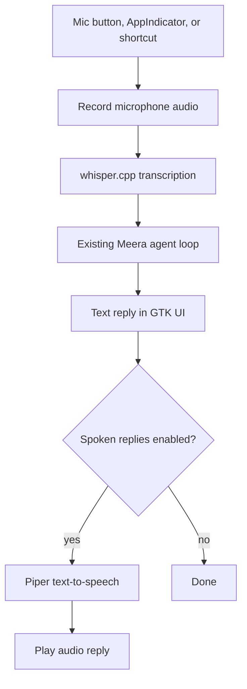

# Phase 5 — Voice Input and Spoken Replies

**Parent doc:** [meera_roadmap.md](../meera_roadmap.md)  
**Predecessor:** [Phase4_plan.md](./Phase4_plan.md) and the install script work in [install_script_plan.md](./install_script_plan.md).  
**Goal:** Add local speech-to-text and text-to-speech so Meera can be used as a quick-access GNOME voice assistant without sending audio or transcripts to a cloud service.

---

## TODOs

- [ ] Add local speech-to-text using `whisper.cpp`.
- [ ] Add local text-to-speech using Piper.
- [ ] Add a `meera voice` entry point that starts push-to-talk voice input.
- [ ] Add a GNOME keyboard shortcut installer flow, with explicit user consent.
- [ ] Add AppIndicator voice actions: `Speak to Meera`, `Stop Listening`, and `Mute Spoken Replies`.
- [ ] Add a microphone button in the GTK UI.
- [ ] Route transcribed text through the existing agent loop as a normal user message.
- [ ] Optionally read Meera's final response aloud with Piper.
- [ ] Add settings for voice input, spoken replies, STT model size, and Piper voice.
- [ ] Add diagnostics to `meera doctor` for microphone, audio playback, `whisper.cpp`, and Piper.

---

## Target experience

Meera should support three voice entry points:

- In-app microphone button.
- AppIndicator menu item: `Speak to Meera`.
- Optional GNOME keyboard shortcut, installed only after asking the user.

Voice mode should be push-to-talk first, not always-on wake-word listening. Wake-word support can be considered later, but it has higher privacy, CPU, and reliability costs.

Typical flow:



---

## Speech-to-text

Use `whisper.cpp` as the first STT backend.

Why `whisper.cpp`:

- Fully local and offline.
- Matches Meera's local-first design.
- Can be distributed as a pinned binary or built/released alongside Meera.
- Works acceptably on CPU with small models.
- Can later support GPU acceleration where practical.

Initial behavior:

- Record audio after the user triggers voice mode.
- Stop recording when the user clicks stop, presses the shortcut again, or after a simple silence timeout.
- Transcribe to text locally with a small/default Whisper model.
- Insert the transcript into the chat input or send it directly as a user message.

Recommended default model:

- Start with `base.en` or `small.en` for English-focused releases.
- Offer `tiny.en` for low-end systems.
- Keep model files in `~/.cache/meera/voice/whisper`.

Non-goals for first pass:

- Always-on wake word.
- Multi-speaker diarization.
- Cloud STT providers.
- Complex live partial-transcript streaming.

---

## Text-to-speech

Use Piper as the first TTS backend.

Why Piper:

- Fully local and offline.
- Good quality for the size.
- Fast enough for assistant responses.
- Simple model-file distribution story.
- Fits the same cache/update approach as GGUF and Whisper models.

Initial behavior:

- Read final assistant replies aloud when spoken replies are enabled.
- Default spoken replies to `Voice mode only`, not always-on.
- Allow stopping playback from the UI or AppIndicator.
- Store Piper voices under `~/.cache/meera/voice/piper`.

Useful modes:

- `Off`: never speak replies.
- `Voice mode only`: speak replies only when the user started the turn by voice.
- `Always`: speak every assistant reply.

Fallback:

- `espeak-ng` can be considered as an emergency fallback if Piper is unavailable, but it should not be the default user experience.

---

## GNOME shortcut

Global keyboard shortcuts are tricky on GNOME/Wayland, so the installer should not silently grab one.

Recommended approach:

- Ask the user whether to create a Meera voice shortcut.
- Use GNOME custom keybindings via `gsettings` when the user agrees.
- Bind the shortcut to a command such as:

```bash
meera voice
```

The `meera voice` command should signal the already-running Meera process rather than launching a second full app instance. Use one of these mechanisms:

- Preferred: D-Bus name owned by the running Meera app.
- Acceptable first version: localhost control socket under the user's runtime directory.
- Fallback: launch Meera and open voice mode if no instance is running.

The exact default shortcut should be chosen conservatively to avoid colliding with GNOME defaults. Candidate examples:

- `Ctrl+Alt+M`
- `Ctrl+Space`
- `Super+M`

The user should be able to skip shortcut creation.

---

## AppIndicator integration

AppIndicator support is best-effort on GNOME. It should enhance quick access when supported, but Meera must still work without it.

Add AppIndicator menu actions:

- `Show Meera`
- `Speak to Meera`
- `Stop Listening`
- `Mute Spoken Replies` / `Unmute Spoken Replies`
- `Restart Model`
- `Unload Model`
- `Quit Meera`

Voice actions should call the same internal code path as the keyboard shortcut and in-app microphone button.

---

## Audio capture and playback

Keep audio plumbing simple for the first version:

- Use PipeWire/PulseAudio-friendly tools or Python bindings that work on GNOME.
- Avoid requiring JACK or advanced audio routing.
- Prefer temporary WAV files or simple pipes before optimizing for streaming.
- Store temporary audio under the user's runtime/cache directory, not the repo.
- Delete temporary recordings after transcription unless debug logging is explicitly enabled.

Potential implementation choices:

- Recording: `parecord`, `pw-record`, or a small Python audio dependency.
- Playback: `paplay`, `pw-play`, `aplay`, or GTK/GStreamer if already available.

The final choice should favor the least new dependency burden on Ubuntu and Fedora GNOME.

---

## Settings

Add user-facing settings after the basic voice path works:

- Voice input: on/off.
- Spoken replies: off / voice mode only / always.
- STT model: tiny / base / small.
- TTS voice: selected Piper voice.
- Shortcut: enabled/disabled and current binding.
- Silence timeout: default value with a reasonable cap.

These settings should live under the same config location chosen by the install script work, likely `~/.config/meera`.

---

## Privacy and safety

Voice features should be explicit and understandable:

- No always-on microphone in Phase 5.
- Show clear UI state while recording.
- Give the user a visible stop control.
- Do not keep recorded audio unless debug mode is enabled.
- Keep STT and TTS local by default.
- Document downloaded voice models and where they are stored.

---

## Implementation order

1. Add a small voice service module that can record audio, run `whisper.cpp`, and return transcript text.
2. Add Piper playback for a plain text string.
3. Add a microphone button in the GTK UI that records, transcribes, and sends the result through the existing agent loop.
4. Add `meera voice` as a launcher/control command for external triggers.
5. Add GNOME shortcut setup with explicit user consent.
6. Add AppIndicator voice actions.
7. Add settings for spoken replies and voice model choices.
8. Add `meera doctor` checks for microphone capture, audio playback, `whisper.cpp`, Piper, and model files.
9. Add tests around command construction, settings, and voice-mode state transitions.

---

## Open decisions

- Whether to ship prebuilt `whisper.cpp` binaries or build them as part of Meera releases.
- Which Whisper model should be the default for the first public release.
- Which Piper voice should be the default.
- Whether `meera voice` should send immediately after transcription or place the transcript into the input box for confirmation.
- Whether spoken replies should default to `Off` or `Voice mode only`.

---

## Carry-over hardening (installer/launcher)

Keep this queued alongside Phase 5 follow-up work:

- Replace launcher `update` flow from `curl ... | sh` to `download -> verify -> execute`.
- Download installer to a temporary file, verify with pinned SHA256 (or signature), then execute only after verification succeeds.
- Keep HTTPS-only transport and fail closed on checksum/signature mismatch.
- Store installer verification metadata in launcher config (for example `MEERA_INSTALLER_SHA256`) so release bumps remain reviewable.
